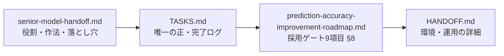
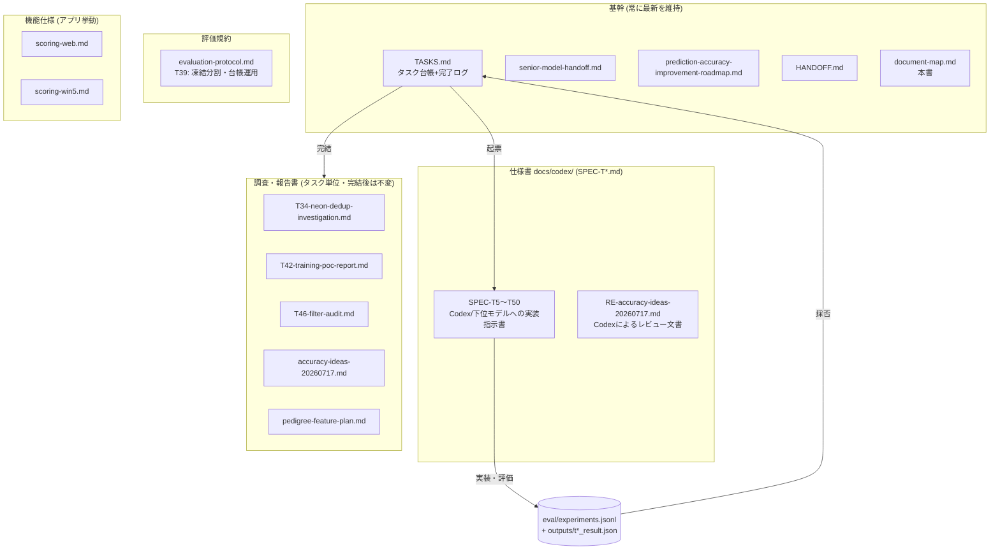
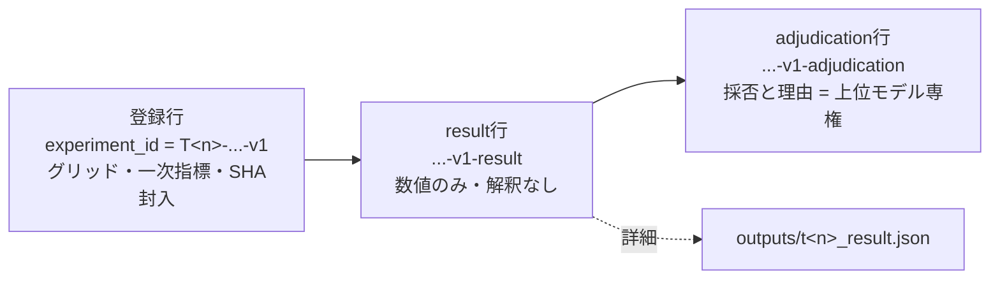

# ドキュメント体系図

作成: 2026-07-19 (Fable 5)。このプロジェクトの文書・データ・ツールの全体地図。
個々の内容はリンク先が正。**タスクの現在状態は常に [TASKS.md](TASKS.md) が唯一の正**。

## 1. 読む順 (上位モデルの入口)



## 2. 文書の分類 (jra-web/docs/)



- **SPECのライフサイクル**: TASKS.md で起票 → `docs/codex/SPEC-T<n>-*.md` 執筆 →
  人手でCodexへ受け渡し → 成果物を上位モデルがレビュー → 採否を台帳と TASKS.md に記録。
  SPEC自体は完了後も履歴として残す (書き換えない)
- **報告書**: タスク完結時点のスナップショット。後から矛盾が出たら TASKS.md 側が正

## 3. 実験台帳の3層構造 (T39)



- 台帳: [../eval/experiments.jsonl](../eval/experiments.jsonl) (追記専用JSONL)
- 完了済み3層の例: T41 / T18 / T43 / T44 (すべて不採用=負の結果も等しく記録)

## 4. 作業ディレクトリ全体 (親リポジトリ jra-tools)

```
c:\Users\owner\project\.venv\   ← venvと作業ツリーが同居 (歴史的経緯)
├── jra-web/                    ← サブモジュール (本体アプリ+モデル+docs)
│   ├── docs/                   ← 本書のある文書体系 (§2)
│   ├── eval/ outputs/          ← 実験台帳と結果 (§3)
│   ├── api/data_files/         ← コース辞典CSV・枠レールバイアス等のデータ
│   ├── backups/                ← 部分実装パッチ等 (T47)
│   └── waku_rail_raw.jsonl     ← T22進行中のレジューム状態 (触らない)
├── scraping.py / jra_db_updater.py / jra_app.py / analysis.py / batch_register.py
│                               ← git追跡中の常用ツール (取得・更新・登録・分析)
├── scrape_courses_full.py / scrape_distance_bias.py /
│   scrape_surface_class_bias.py / scrape_upset.py
│                               ← api/data_files の生成元スクレイパ (upsetは東京のみ=未完)
├── system_diagram.drawio       ← システム構成図 (drawio)
├── DATA/ csv/                  ← 場別メモ・場別CSV (手動管理データ)
├── old/<日付>/                 ← 隔離慣例。各回の MANIFEST.md に移動理由と復元先
└── Lib/ Scripts/ etc/ share/   ← venv本体 (プロジェクト資料ではない・触らない)
```

## 5. メンテナンス規約

- 一時ファイル・完了済み単発スクリプトは削除せず `old/<日付>/` へ隔離し、
  同フォルダの `MANIFEST.md` に「何を・なぜ・どう戻すか」を1行ずつ残す (直近: old/20260719/)
- 新しい文書は上の分類のどれかに置く。分類に収まらない文書を作る場合は本書も更新する
- `.env` (各種トークン・DB接続文字列) はどの分類にも属さない。**絶対にコミットしない**
